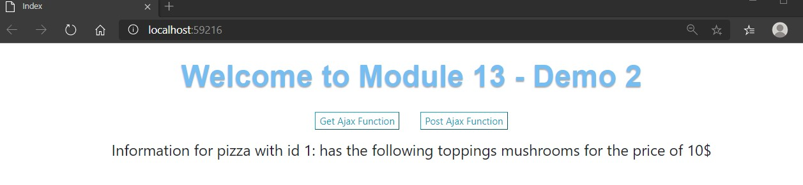
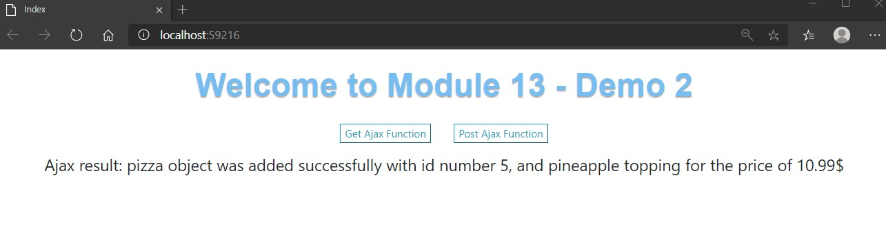

# Tareas del MOC

## Module 13: Implementing Web APIs

# Lesson 3: Calling a Web API 

### Demonstration: How to Call Web APIs by Using jQuery Code

- Creamos un controlador **PizzaController**

  - Le añadimos el constructor que añade 4 pizzas
  - Añadimos la accion httpget **GetById** y la httppost **Post**

- Creamos dos JavaScript para el boton de get y post

- Y en el **Index.html** incluimos los enlaces a los JavaScript y el codigo de los botones

- Ejecutamos y comprobamos la salida

  - Get

  

  

  

  

  Post

  

  

  

  
